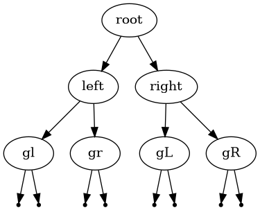

# package tree notes

`package tree` is for the most part,
support functions that are common to at least a few of the binary tree puzzles
or interview questions.

## Data Structures

In this package, a binary tree consists of instances of
either type `NumericNode`, or type `StringNode`.
The root of the tree is merely a pointer to an instance of one of those types,
not a instance of a special "tree" struct.

Connection to left and right sub-trees is through pointers.
Making both root and connections to sub-trees pointers means
that recursive functions can act on the tree,
pruning it or rearranging nodes.


### struct NumericNode

```go
type NumericNode struct {
    Data  int
    Left  *Node
    Right *Node
}
```

Numeric data, allowing the tree to be ordered.

Fields are exported because a lot of the problems require
either getters/setters (ugh) or direct access to instance internals.

### struct StringNode

```go
type StringNode struct {
    Data  string
    Left  *StringNode 
    Right *StringNode
}
```

`*StringNode` and `*NumericNode` have methods that allow them to fit
`interface Node`.

### interface Node

```go
type Node interface {
    LeftChild() Node
    RightChild() Node
    SetLeftChild(Node)
    SetRightChild(Node)
    IsNil() bool
    String() string
}
```

Dismayingly, `LeftChild()` and `RightChild()` are both "getters,
while `SetLeftChild(Node)` and `SetRightChild(Node)` are both "setters".

The same function (`func DrawPrefixed(out io.Writer, node Node, prefix string)`)
can generate GraphViz output for trees of both `*NumericNode` and `*StringNode`
types.

## Input/Output

### Creating a Binary Search Tree one integer at a time

```go
func Insert(node *NumericNode, value int) *NumericNode
```
I'm convinced that this style of use is the One True Way:

```go
	var root *tree.NumericNode

	for i := range inputNumbers {
		root = tree.Insert(root, inputNumbers[i])
	}
```

At first it seems wrong to pass in a nil root pointer,
but doing so allows the code of `func Insert()` to be simple,
and recursively handle all tree insertion.

The other aspect of the One True Way to deal with binary trees
is to not check if left and/or right child pointer members are nil,
but rather to check `node.IsNil()` at recursive function entrance.
This simplifies the recursive code by having only one
check for nil instead of one for left child and one for right child.
Go facilitates this by allowing method calls on nil pointer objects.

Something like this illustrates:

```go
func invert(node tree.Node) {
    if node.IsNil() {
        return // recusion terminates here
    }
    invert(node.LeftChild())  // left child can be nil
    invert(node.RightChild()) // right child can be nil
    left := node.LeftChild()
    right := node.RightChild()
    node.SetLeftChild(right)
    node.SetRightChild(left)
}
```

The same `func invert` works on `tree.NumericNode` or `tree.StringNode` trees.

### Creating a binary search tree from a list of numeric string representations

```go
func CreateNumeric(numberRepr []string) (root *NumericNode)
```

Creates a binary search tree of type `*NumericNode` from a slice of strings.
The strings have to be representations of integers.

### Creating a tree from a string representation

```go
func CreateFromString(stringrep string) (root *StringNode)
```

This function will create a tree of type `*StringNode`.
The format of `stringrep` is something like a Lisp expression:
An input string `(root(left(gl)(gr))(right(gL)(gR))`
results in a tree like this:



No error recovery, very brittle parsing,
you have to parenthesize every value,
even single-value leaf nodes.
you have to indicate nil left children with `()` if you have non-nil right children.
`()` is optional for nil right children, due to mediocre parsing.

### GraphViz drawing of a tree

```go
func Draw(root drawable)
func DrawPrefixed(out io.Writer, root drawable, prefix string)
```

Both of these accept the root of a binary tree,
comprised of either `*NumericNode` or `*StringNode` elements,
and output [GraphViz](https://graphviz.org) directives
that can be used as input to `dot` to get a visualization
of the tree.

Programs `drawtree`, `invert`, `minimal_ht_tree`, `prune_tree`,
`reconstruct` all create GraphViz output,
always on stdout because I find redirection far more convenient
than an output-to-file command line flag.

`DrawPrefixed` gets used to create visualizations of two binary
trees side-by-side for comparison.
Use is a little bit more involved than `func Draw`.

```go
fmt.Printf("digraph g1 {\n")
fmt.Printf("subgraph cluster_0 {\n\tlabel=\"before\"\n")
tree.DrawPrefixed(os.Stdout, originalTree, "orig")
fmt.Printf("\n}\n") // close cluster_0
fmt.Printf("subgraph cluster_1 {\n\tlabel=\"after\"\n")
tree.DrawPrefixed(os.Stdout, changedTree, "mangled")
fmt.Printf("\n}\n") // close cluster_1
fmt.Printf("\n}\n") // close g1
```

Your code has to "open" and "close" the individual cluster's
GraphViz subgraphs.
You can do more than 2 subgraphs.
`func Draw` is implemented by calling `func DrawPrefixed`
with hard-coded arguments.

## Traversing a Tree

```
type VisitorFunc func(node Node)

func InorderTraverseVisit(node Node, fn VisitorFunc)
func PreorderTraverseVisit(node Node, fn VisitorFunc)
func AllorderTraverseVisit(node Node, preorderfn, inorderfn, postorderfn VisitorFunc)

func PreorderTraverse(node Node)
func InorderTraverse(node Node)
```
`PreorderTraverse` and `InorderTraverse` print the nodes of the tree
in preorder and inorder.
Underneath the covers, they use `PreorderTraverseVisit` and `InorderTraverseVisit`
with a pre-defined visitor function that just invokes `fmt.Printf("%s ", node) 

`PreorderTraverseVisit` and `InorderTraverseVisit` could be written in
terms of `AllorderTraverseVisit`, which is general enough to subsume both
of them, but currently aren't.

## Tree Properties

### Binary Search Tree

```go
func BstProperty(root *NumericNode) bool
```

returns true if `root` (representing a numeric-valued binary tree)
has the official "binary search tree property",
where all of the nodes in the left subtree have a value less than root's value,
and all of the nodes in the right subtree have a value greater than root's value.
This allows for no duplicate value nodes.

A lot of puzzles specify creating a tree with this property,
or input trees with this property.
I'm sure that interviewers have asked merely how to check
if an input tree has this property.
It's worth having this to demonstrate that puzzles/problems
got solved correctly.

### Equality of two trees

```go
func Equals(t1, t2 Node) bool
```

Do `t1` and `t2` have child nodes with the same values,
in the same position in their respective trees?
Return true.
Otherwise, return false.
### Depth (or height) of tree

```go
func FindDepth2(root \*NumericNode, depth int) (depth int, deepnode *NumericNode)
```

Find the depth (or height, depending on how you want to look at it)
of a given binary tree.
This is the answer to one puzzle that asked merely for
an algorithm for the depth of a tree,
and support for the "compose minimum height tree from sorted array"
puzzle.

